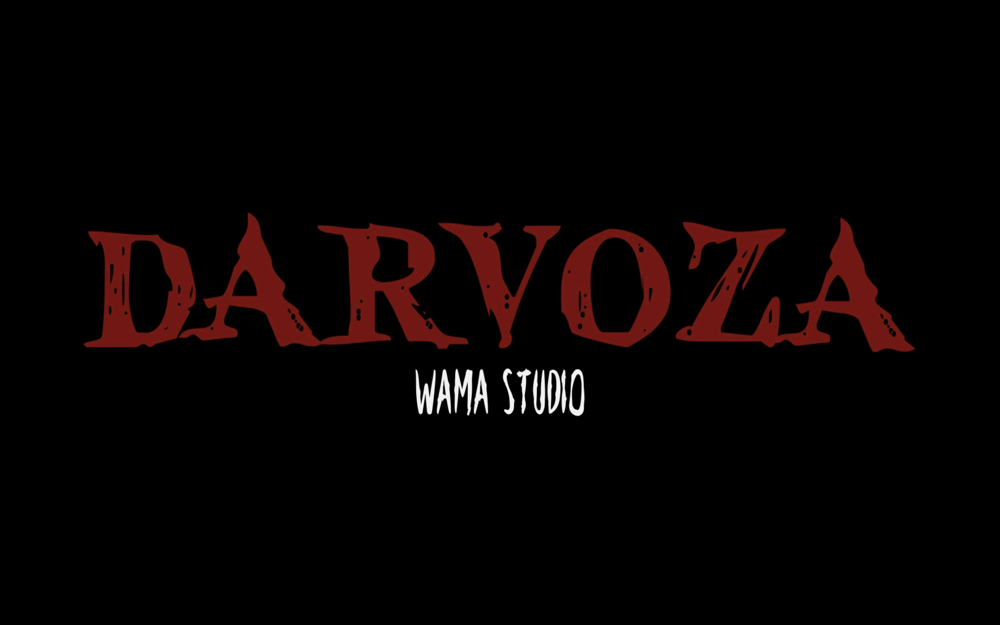
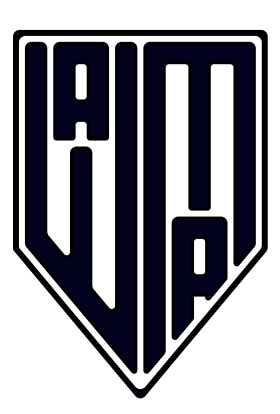

<h1 align="center">Darvoza</h1>

  

## Sommaire
1. [Introduction](#introduction)
2. [Installation](#installation)
3. [Utilisation](#utilisation)
4. [Technologies Utilisées](#technologies-utilisées)
5. [Équipe](#équipe)
6. [Personnages](#personnages)
7. [Photos du Jeu](#photos-du-jeu)

## Introduction
Bienvenue dans **Darvoza**! Ce jeu a été entièrement développé par **WAMA Studio**.

Nous avons consacré six mois, du 1er janvier au 30 mai, à développer ce jeu 2D avec aucune connaissances préalable en développement de jeux. Nous avons uniquement utilisé du code et des assets graphiques, sans recourir à un moteur de jeu.

## Installation
Pour installer et lancer le jeu, suivez les étapes suivantes :

1. Installez **Visual Studio Code** (VSCode) depuis [ce lien](https://code.visualstudio.com/).
2. Ouvrez VSCode et installez les extensions **Live Server** et **p5.js**.
3. Clonez ce dépôt sur votre machine locale.
4. Ouvrez le fichier `index.html` dans VSCode.
5. Faites un clic droit sur `index.html` et sélectionnez **Open with Live Server**.

## Utilisation
Une fois le serveur en direct lancé via Live Server :
1. Assurez-vous d'avoir un PC sous Windows pour une expérience optimale.
2. Lancez le jeu sur le navigateur de votre choix.
3. Assurez-vous que votre résolution d'écran est définie sur 2880 × 1864p pour une qualité maximale.
4. Il ne vous reste plus qu'a appuyer sur "play" et le jeu est lancé !

:attention: Si le mode plein écran n'est pas activé activez le en cliquant n'importe où sur la fenêtre de jeu ou en l'activant manuellement en suivant la documentation de votre navigateur.

## Technologies Utilisées
Ce projet a été réalisé en utilisant les technologies suivantes :

   

## Équipe
Nous sommes **WAMA Studio**, une petite équipe avec de grands projets. Nous sommes des passionnés qui s'efforcent de créer des expériences de jeu uniques et mémorables.

  <a href="https://readymag.website/u243684301/4794535/" target="_blank">Visitez notre site web !</a>

  

### Membres de l'équipe :

  <b>William-John Guénon</b> (Développeur)  
  <!--   -->
  <b>Aléna Dachy</b> (Designer)  
  <!--   -->
  <b>Mélina Riccobono</b> (Designer)  
  <!--   -->
  <b>Alexis Raymond</b> (Designer)  
  <!--  -->

<!-- ## Personnages
Découvrez les personnages fascinants de **Darvoza** :

  
  
  
  
  

## Photos du Jeu

  
  

  
  

  

 -->
